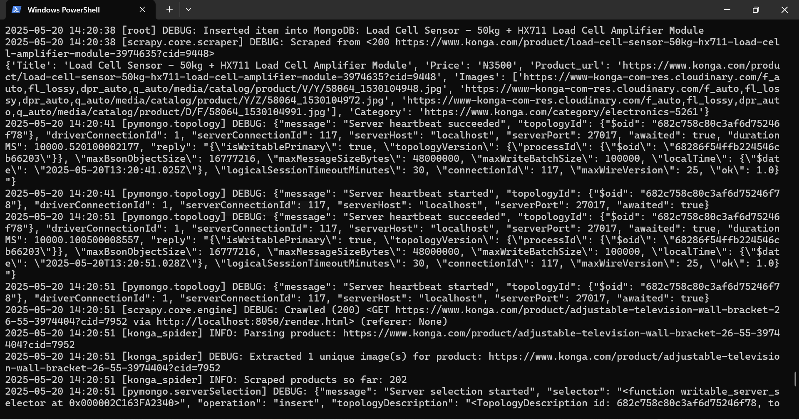
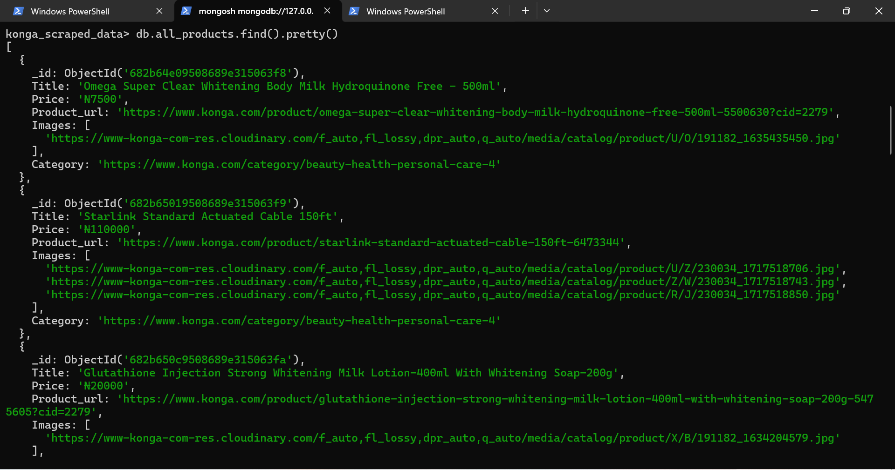

Sure! Here's a clean, re-edited version of your README with the **snapshot images moved and formatted** in a way that works well and is commonly used — inside a dedicated **"Snapshots"** or **"Demo"** section near the end, right before Notes & Tips. Also, I fixed minor Markdown formatting and indentation issues for you:

---

# Konga Products Crawler

Welcome to the **Konga Products Crawler** — your reliable, splash-powered Scrapy spider that dives deep into Konga.com to extract product details across multiple categories with finesse and precision! 🚀✨

---

## 🚀 Overview

This project is a robust, scalable Scrapy spider integrated with **Splash** to handle dynamic JavaScript-rendered pages on Konga.com — one of Nigeria’s biggest online marketplaces. It scrapes product titles, prices, images, and URLs from five major product categories including beauty, fashion, baby & kids, home & kitchen, and electronics.

The crawler is designed with care for reliability, featuring retry mechanisms, pagination handling, and category skipping. It stores the scraped data directly into MongoDB, ensuring no duplicates with unique indexing.

---

## 🎯 Features

* **Splash integration** to render JS-heavy pages seamlessly.
* Scrapes multiple categories sequentially with intelligent skip logic.
* Pagination navigation with retry support on empty or failed pages.
* Limits to 5 products per page for focused, quality data.
* Extracts product title, price, URLs, and up to 3 unique images.
* Custom downloader middleware rotating User-Agent from a list for stealth.
* MongoDB pipeline with unique indexing and robust error handling.
* Autothrottle and caching enabled to be gentle on servers.
* Detailed logging at INFO and DEBUG levels for full visibility.

---

## 🛠️ Installation & Setup

1. **Clone this repo**

   ```shell
   git clone https://github.com/yourusername/konga_products_crawler.git
   cd konga_products_crawler
   ```

2. **Install dependencies**

   You need Python 3.x, Scrapy, Splash, and PyMongo.

   ```shell
   pip install scrapy scrapy-splash pymongo
   ```

3. **Run Splash**

   Splash is required to render pages with JavaScript.

   If you have Docker:

   ```shell
   docker run -p 8050:8050 scrapinghub/splash
   ```

   Splash will be available at [http://localhost:8050](http://localhost:8050).

4. **Set up MongoDB**

   Run your MongoDB server locally or remotely. Default URI: `mongodb://localhost:27017/`.

5. **Configure Settings**

   Review `settings.py` to tweak parameters like `DOWNLOAD_DELAY`, MongoDB URI, or User-Agent list.

---

## 🕷️ How to Run the Spider

Run the spider using Scrapy CLI:

```shell
scrapy crawl konga_spider
```

You’ll see logs informing you of progress, retries, and any issues.

---

## 📸 Snapshots & Demo

### Spider Running



### Sample Scraped Data in MongoDB



---

## 🧩 Project Structure Highlights

* **Spider:** `konga_spider.py`
  Starts with 5 category URLs. Sequentially requests pages with Splash rendering. Parses product URLs and limits scraping to 5 products per page. Extracts product details with graceful retry on failures. Skips empty pages or entire categories if configured. Yields items for MongoDB storage.

* **Settings:** `settings.py`
  Configures Splash URL and middleware. Enables caching, autothrottle, retries. Disables obeying robots.txt for full crawl freedom. Includes a rotating User-Agent list to mimic real users. Sets MongoDB connection parameters. Enables MongoDB pipeline to save scraped items.

* **Middleware:** `middlewares.py`
  Custom `RandomUserAgentMiddleware` to assign random User-Agent on each request. Default spider and downloader middleware stubs for potential future extensions. Integrates Splash middleware to handle JS rendering and cookies.

* **Pipeline:** `pipelines.py`
  Connects to MongoDB with retry and timeout settings. Creates unique index on `Product_url` to avoid duplicate records. Inserts each product item and skips duplicates with logs. Closes MongoDB connection cleanly when spider finishes.

---

## ⚠️ Challenges & How I Overcame Them

* **Splash timing out on slow pages**
  Some category pages loaded slowly, causing timeouts. I increased the wait time and added retry logic to keep the scraper running smoothly.

* **Duplicate products in MongoDB**
  I saw repeated entries at first, so I tracked seen URLs in memory and created a unique index on `Product_url` in MongoDB to prevent duplicates.

* **Getting stuck on empty categories**
  The spider would loop endlessly when a category had no products. Adding a check to skip empty categories helped keep the crawl moving forward.

* **Scraping merchant pages by mistake**
  Some links pointed to merchant profiles instead of products. I refined the XPath to only grab URLs containing `/product/` to target actual products.

* **Splash container crashing after many requests**
  The Splash Docker container would disconnect after about 300 requests. I reduced requests per page, added delays, and restarted the container when needed.

* **Finding the right amount of data**
  Trying to scrape 5,000 products was too slow and caused crashes. I scaled back to around 2,500 products, which still provides solid data for testing and demos.

---

## 🧠 Notes & Tips

* Modify `categories_to_skip` list in the spider to exclude any category URLs you don’t want scraped.
* Adjust `DOWNLOAD_DELAY` and `AUTOTHROTTLE` settings to balance speed and server friendliness.
* MongoDB collection is fixed to `all_products`, but you can change this in the pipeline.
* Extend the User-Agent list in settings for better anti-blocking.
* Use Docker for Splash for easy installation and environment consistency.
* Logs at DEBUG level give detailed request/response info for troubleshooting.

---

## 🏆 Why This Project Rocks

* Uses the power of Splash to break through JavaScript barriers many spiders fail at.
* Carefully crafted retry logic keeps the crawl resilient even with flaky network or site changes.
* MongoDB pipeline prevents duplicates and ensures data integrity.
* User-Agent rotation minimizes chances of getting blocked.
* Clear, modular code structure means easy customization and extension.

---

## 👨‍💻 Contribution

Feel free to fork, improve, and submit pull requests! Whether it’s adding more categories, improving error handling, or optimizing the pipeline, your contributions are welcome.

---

## 📜 License

MIT License — free to use, modify, and share

---

### Notes

* Make sure your image files **exactly match** these filenames including case:
  `snapshots/konga_snapshot.PNG`
  `snapshots/konga_snapshot+mongo.PNG`
* If you want to avoid issues with the `+` sign in filenames, consider renaming it (e.g., `konga_snapshot_mongo.PNG`) and update the README accordingly.

---

If you want me to help you with that rename or any other formatting, just say so!
